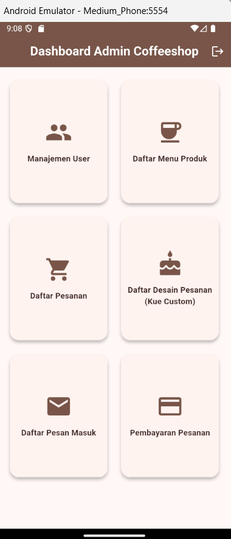
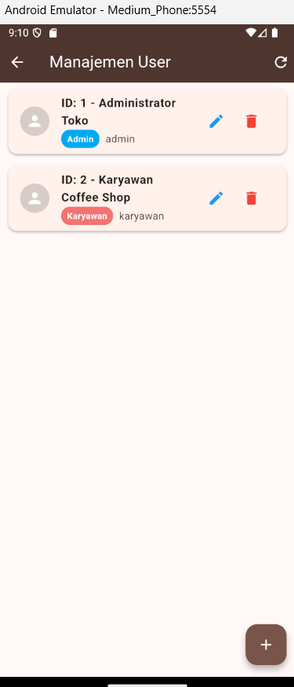
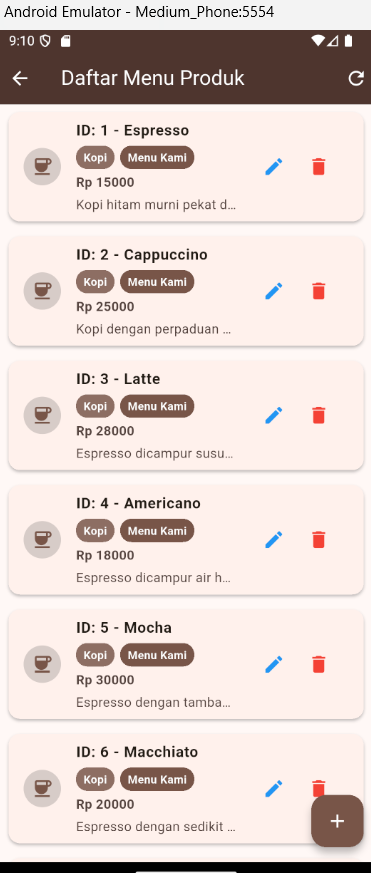
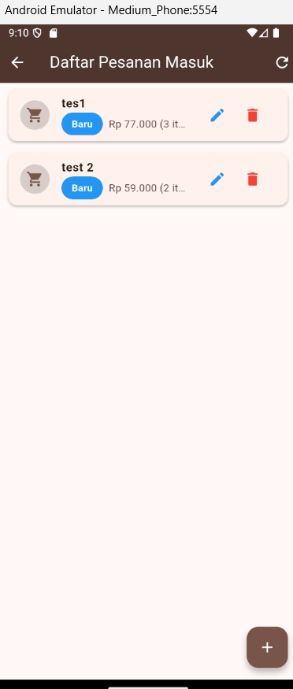
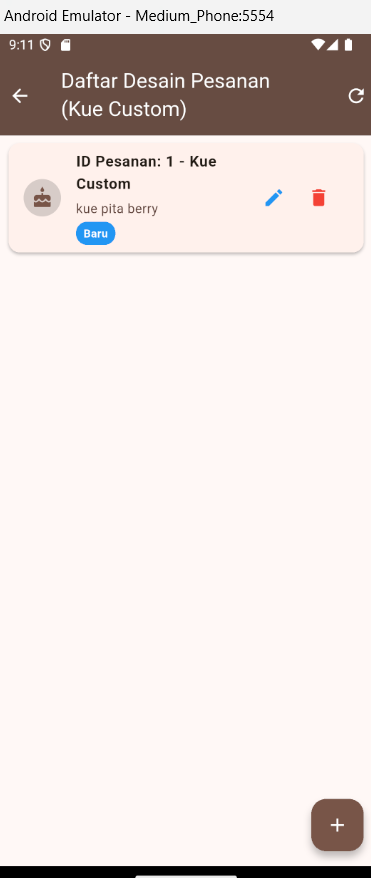

# Classic Coffee Admin & Cashier App

Classic Coffee Admin & Cashier App — A cross-platform Flutter application tailored for administrators and employees, facilitating live order queue processing, custom cake reviews, and transaction updates.

## Fitur Utama

- **Manajemen User:** Pengelolaan data karyawan dan admin secara langsung (tambah, edit, hapus) dengan pembatasan hak akses.
- **Daftar Menu Produk:** Pengelolaan data menu kopi, non-kopi, dan pastry (tambah, edit, hapus).
- **Proses Antrean Pesanan:** Pemantauan pesanan baru dari pelanggan yang masuk secara real-time.
- **Desain Pesanan Kue Custom:** Tinjauan dan pengelolaan pesanan desain kue custom yang dikirim pelanggan.
- **Konfirmasi Pembayaran:** Modul kasir untuk memverifikasi pembayaran pelanggan secara instan.
- **Scroll Position Persistence:** Posisi scroll daftar data tetap bertahan dan tidak melompat ke atas saat melakukan refresh, penambahan, atau penghapusan data.

## Keterangan Operasi CRUD

Aplikasi Flutter ini memiliki modul CRUD (Create, Read, Update, Delete) yang terhubung ke server Spring Boot:

1. **Modul Manajemen User (CRUD Lengkap):**
   - **Create:** Menambahkan akun pengguna baru (nama, username, password, dan level akses).
   - **Read:** Menampilkan daftar seluruh akun karyawan/admin pada sistem.
   - **Update:** Memperbarui data pengguna (nama, username, password, atau hak akses).
   - **Delete:** Menghapus akun pengguna secara permanen dari database.
2. **Modul Daftar Menu Produk (CRUD Lengkap):**
   - **Create:** Menambahkan produk kopi/kue baru (nama produk, kategori, bagian, harga, deskripsi).
   - **Read:** Menampilkan daftar seluruh menu aktif yang tersedia untuk pelanggan.
   - **Update:** Mengubah detail informasi produk (nama, harga, deskripsi, dll.).
   - **Delete:** Menghapus menu produk secara permanen dari sistem.
3. **Modul Antrean & Pembayaran Pesanan (Update & Read):**
   - **Read:** Membaca data pesanan masuk dan status pembayaran pelanggan.
   - **Update:** Mengubah status pengerjaan pesanan (dari baru ke proses/selesai) dan memverifikasi pembayaran transaksi.
   - **Delete:** Menghapus data pesanan dari daftar antrean jika dibatalkan.
4. **Modul Desain Pesanan Kue Custom (CRUD Lengkap):**
   - **Create:** Membuat data pemesanan desain baru.
   - **Read:** Menampilkan daftar kiriman desain kue custom dari pelanggan.
   - **Update:** Memperbarui detail status pengerjaan desain kue custom.
   - **Delete:** Menghapus data desain dari daftar review.

## Teknologi

- **Framework:** Flutter (Dart)
- **State & Data Persistence:** State Management Flutter, Integration Service
- **Penyimpanan Lokal:** SQLite / Database Helper
- **API Client:** HTTP Client terintegrasi dengan Spring Boot Server

## Panduan Instalasi & Menjalankan Project

1. Pastikan Flutter SDK telah terinstal di komputer Anda.
2. Hubungkan perangkat fisik Android atau jalankan Android Emulator.
3. Clone repository ini ke dalam direktori lokal Anda.
4. Jalankan perintah flutter pub get untuk mengunduh dependensi:
   ```bash
   flutter pub get
   ```
5. Jalankan aplikasi di emulator atau perangkat yang aktif:
   ```bash
   flutter run
   ```

## Deployment / Rilis via GitHub

Untuk mendistribusikan aplikasi Flutter (Android) melalui GitHub, Anda dapat membuat file rilis APK menggunakan fitur **GitHub Releases**:

### Langkah Pembuatan Rilis APK
1. Lakukan kompilasi aplikasi Flutter ke dalam mode rilis (release) untuk menghasilkan berkas APK:
   ```bash
   flutter build apk --release
   ```
2. Berkas APK hasil kompilasi akan tersimpan pada folder `build/app/outputs/flutter-apk/app-release.apk`.
3. Buka halaman repository GitHub Anda, lalu pilih menu **Releases** di bagian kanan halaman.
4. Klik **Create a new release** (atau Draft a new release).
5. Tentukan tag versi baru (misalnya `v1.0.0`) dan judul rilis Anda.
6. Unggah berkas `app-release.apk` tersebut ke kolom upload binary rilis yang tersedia.
7. Klik **Publish release** untuk membagikan file instalasi APK kepada pengguna lain.

---

## Dokumentasi & Demo

Berikut adalah visualisasi antarmuka aplikasi Flutter pada emulator Android:

| Fitur | Tampilan Dokumentasi | Deskripsi |
| --- | --- | --- |
| **Dashboard Menu Utama** |  | Halaman menu utama admin yang berisi opsi navigasi manajemen aplikasi. |
| **Halaman Manajemen User** |  | Antarmuka pengelolaan data akun karyawan dan level akses. |
| **Daftar Menu Produk** |  | Antarmuka manajemen data produk kopi dan kue. |
| **Daftar Pesanan Masuk** |  | Antrean data pesanan pelanggan reguler yang masuk ke sistem. |
| **Desain Pesanan Custom** |  | Daftar review desain kue custom yang dikirim pelanggan. |
| **Halaman Login** | *(Masukkan gambar di sini)* | Halaman masuk aplikasi untuk Admin dan Karyawan. |
| **Konfirmasi Pembayaran** | *(Masukkan gambar di sini)* | Modul kasir untuk melakukan verifikasi pembayaran pesanan. |
